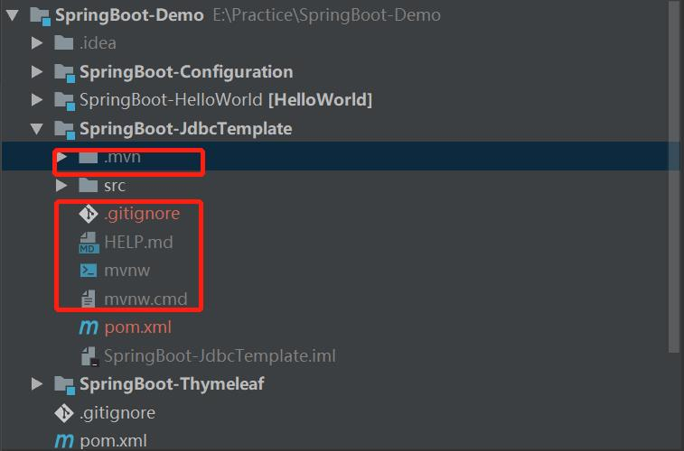

SpringBoot 是为了简化 Spring 应用的创建、运行、调试、部署等一系列问题而诞生的产物，自动装配的特性让我们可以更好的关注业务本身而不是外部的XML配置，我们只需遵循规范，引入相关的依赖就可以轻易的搭建出一个 WEB 工程。
未接触 SpringBoot 之前，搭建一个普通的 WEB 工程往往需要花费很长时间，使用SpringBoot可以快速的搭建一个SpringBoot项目。

## SpringBoot入门
SpringBoot-HelloWorld  

### 项目的创建

```$java
server.port=8080
server.servlet.context-path=/springboot-hello
local.server.port=8080
```

```java
package com.springboot.demo.hello.controller;

import org.springframework.boot.autoconfigure.EnableAutoConfiguration;
import org.springframework.stereotype.Controller;
import org.springframework.web.bind.annotation.RequestMapping;
import org.springframework.web.bind.annotation.ResponseBody;

@Controller
@EnableAutoConfiguration
public class HelloWorldController {

    @RequestMapping("/")
    @ResponseBody
    String sayHello() {
        return "Hello World!";
    }

}
```
测试类
```java
package com.springboot.demo.hello;

import org.junit.Before;
import org.junit.Test;
import org.junit.runner.RunWith;
import org.springframework.beans.factory.annotation.Autowired;
import org.springframework.boot.test.context.SpringBootTest;
import org.springframework.boot.test.web.client.TestRestTemplate;
import org.springframework.boot.web.server.LocalServerPort;
import org.springframework.http.ResponseEntity;
import org.springframework.test.context.junit4.SpringRunner;

import java.net.URL;

import static org.junit.Assert.assertEquals;

@RunWith(SpringRunner.class)
@SpringBootTest(webEnvironment = SpringBootTest.WebEnvironment.RANDOM_PORT)
public class SpringBootHelloApplicationTests {

    @LocalServerPort
    private int port;

    private URL base;

    @Autowired
    private TestRestTemplate template;

    @Before
    public void setUp() throws Exception {
        this.base = new URL("http://localhost:" + port + "/springboot-hello");
    }

    @Test
    public void testHello() {
        ResponseEntity<String> response = template.getForEntity(base.toString(), String.class);
        assertEquals(response.getBody(), "Hello World!");
    }

}

```
### 自定义banner
借助在线工具生成banner文件，将文件放到resource文件夹中
http://www.bootschool.net/ascii

## SpringBoot配置
* 运行方法：浏览器输入 
http://localhost:8080/dev/properties/default
http://localhost:8080/dev/properties/connection

* 掌握@ConfigurationProperties、@PropertySource 等注解的用法及作用

* 掌握编写自定义配置

* 掌握外部命令引导配置的方式
在命令行输入java -jar app.jar --spring.profiles.active=test --connection.username=root

* 在真实的应用中，常常会有多个环境（如：开发，测试，生产等），不同的环境数据库连接都不一样，这个时候就需要用到spring.profile.active 的强大功能了，它的格式为 application-{profile}.properties，这里的 application 为前缀不能改，{profile} 是我们自己定义的。

* 遇到了一个坑，记录一下：
springboot2.1.6 spring-boot-configuration-processor一直下载不到，把国内阿里的镜像去掉使用默认的就好了
特此记录-20190709
电脑上maven的镜像一直是阿里的
```xml
<mirror>
      <id>alimaven</id>
      <name>aliyun maven</name>
      <url>
          http://maven.aliyun.com/nexus/content/groups/public/
      </url>
      <mirrorOf>central</mirrorOf>        
    </mirror>
```
## 整合Thymeleaf模板
Thymeleaf是现代化服务器端的Java模板引擎，不同与其它几种模板的是Thymeleaf的语法更加接近HTML，并且具有很高的扩展性。

* 访问地址：http://localhost:8080/index

将html文件放到resources/templates目录下。在html标签中接入thymeleaf命名空间
```xml
<html xmlns="http://www.w3.org/1999/xhtml"
      xmlns:th="http://www.thymeleaf.org">
```

controller中内容如下
```java
@Controller
@RequestMapping
public class ThymeleafController {

    @GetMapping("/index")
    public ModelAndView index() {

        ModelAndView mv = new ModelAndView();
        mv.setViewName("index");
        mv.addObject("title","这是我的第一个thymleaf页面");
        mv.addObject("desc","坚持各种学习");

        Student student = new Student();
        student.setName("王利峰");
        student.setAge(35);
        student.setEmail("wanglf1207@163.com");

        mv.addObject("student",student);
        return mv;
    }
}
```

## 使用JdbcTemplate访问数据库

创建数据库
```sql
create database springboot;
```
创建表
```sql
use springboot;

create table user(
  id int(8) not null auto_increment,
  username varchar(50) not null,
  password varchar(50) not null,
  primary key (id)
);

```

连接数据库的时候碰到一个错误：
```java
com.mysql.cj.exceptions.InvalidConnectionAttributeException: The server time zone value 'EDT' is unrecognized or represents more than one time zone. You must configure either the server or JDBC driver (via the serverTimezone configuration property) to use a more specifc time zone value if you want to utilize time zone support.
	at sun.reflect.NativeConstructorAccessorImpl.newInstance0(Native Method) ~[na:1.8.0_121]
	at sun.reflect.NativeConstructorAccessorImpl.newInstance(NativeConstructorAccessorImpl.java:62) ~[na:1.8.0_121]
	at sun.reflect.DelegatingConstructorAccessorImpl.newInstance(DelegatingConstructorAccessorImpl.java:45) ~[na:1.8.0_121]
	at java.lang.reflect.Constructor.newInstance(Constructor.java:423) ~[na:1.8.0_121]
```

解决办法：
* 在mysql中执行show variables like '%time_zone%';
* 输入select nows();
* 在终端执行date命令 此时发现终端显示的时间和MySql中显示的时间不一致，这就是问题所在。
* 在mysql中执行 set time_zone=SYSTEM;
* 再次在mysql中执行select now();
* 执行 set global time_zone='+8:00';
* 执行 flush privileges;